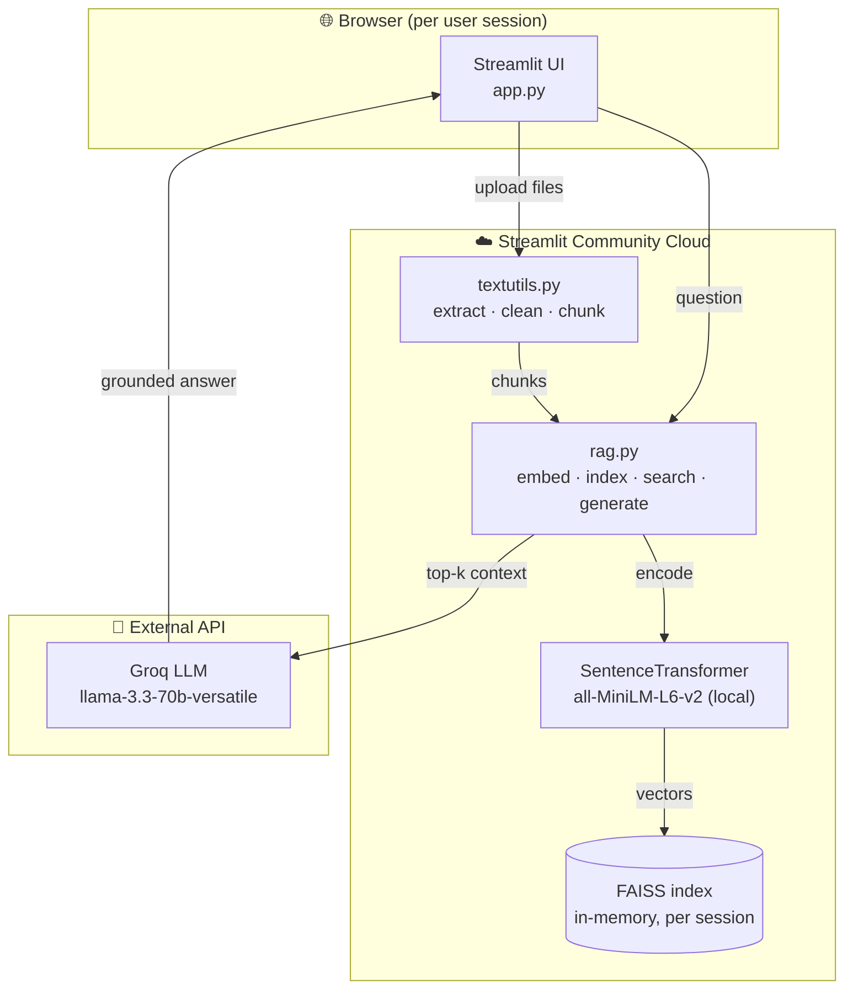
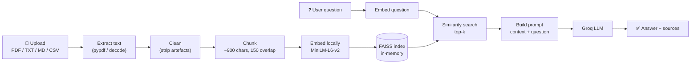
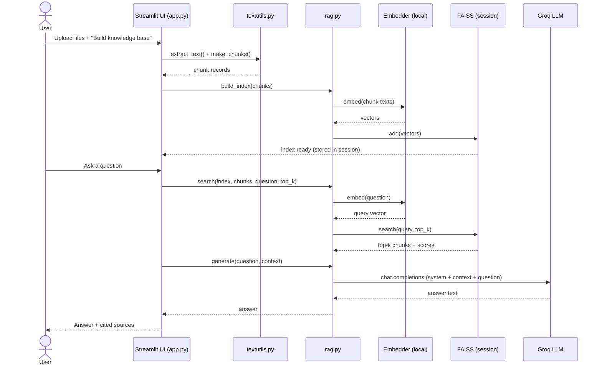

# 📄 AskDocs — chat with your documents

Upload your own documents (PDF, TXT, Markdown, CSV) and ask questions about
them. **AskDocs** retrieves the most relevant passages and answers with a hosted
LLM, citing its sources. Embeddings run locally (fast on Apple Silicon);
generation runs on Groq's fast hosted API. A bundled set of Operations
Management notes is available as a one-click sample.

- **Embeddings:** `sentence-transformers/all-MiniLM-L6-v2` (runs locally, no key)
- **Vector store:** FAISS (built in-memory, per session)
- **LLM:** [Groq](https://groq.com) — default `llama-3.3-70b-versatile` (fast, free tier)
- **UI:** Streamlit chat

> 📋 Full product spec: [docs/PRD.md](docs/PRD.md)

## Architecture



## Data / processing flow



## Sequence (ask a question)



## Setup

1. **Get a free Groq API key** at https://console.groq.com/keys, then:
   ```bash
   cd /tmp/pom-rag-chatbot
   cp .env.example .env      # then paste your key into .env
   ```

2. **Create a virtual environment and install dependencies:**
   ```bash
   python3 -m venv .venv
   source .venv/bin/activate
   pip install -r requirements.txt
   ```

## Run

```bash
streamlit run app.py
```

Then in the app: upload your files → **Build knowledge base** → ask questions.
No pre-build step is needed — the index is created from your uploads at runtime.

**Optional — bundled sample:** click *"Try the sample"* in the sidebar to chat
with the included Operations Management notes. To use them from the CLI you can
pre-build a disk index once with `python ingest.py`, then:
```bash
python rag.py "What are the four sources of process variation?"
```

## Deploy (Streamlit Community Cloud)

1. Push this repo to GitHub (public).
2. On https://share.streamlit.io → **Create app** → pick this repo, branch
   `main`, main file `app.py`.
3. In **Advanced settings → Secrets**, add your key in **TOML** format
   (note the quotes — different from `.env`):
   ```toml
   GROQ_API_KEY = "gsk_your_actual_key_here"
   ```
4. **Deploy.** You get a permanent public `*.streamlit.app` link to share.

> The `.env` file is git-ignored and never deployed, so on the cloud the key
> **must** come from Streamlit Secrets. Locally it comes from `.env`.

## Files

| File | Purpose |
|------|---------|
| `config.py` | Paths, model names, chunk & retrieval settings |
| `textutils.py` | Extract text (PDF/TXT/MD/CSV), clean & chunk |
| `rag.py` | Embed, build in-memory index, search, generate via Groq |
| `ingest.py` | Build an on-disk index of the bundled sample notes (optional) |
| `app.py` | Streamlit upload + chat interface |
| `data/` | Bundled sample notes (Operations Management) |
| `index/` | Generated sample index (git-ignored) |

## Tuning

Edit `config.py`:
- `CHUNK_SIZE` / `CHUNK_OVERLAP` — how documents are split
- `TOP_K` — how many chunks are fed to the model
- `LLM_MODEL` — swap in any Groq model (e.g. `llama-3.1-8b-instant`)
