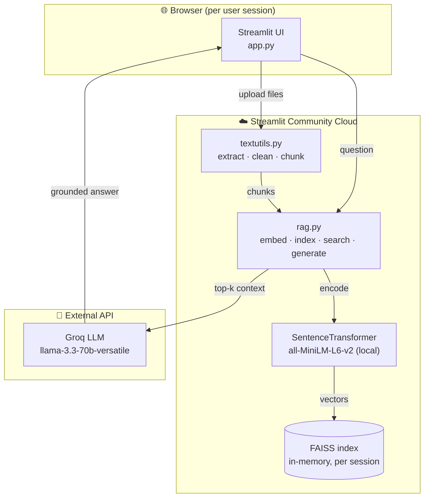
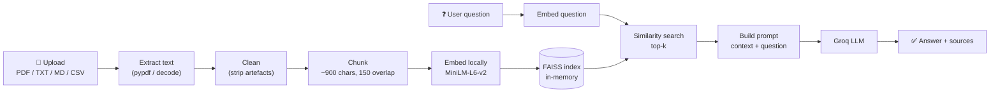
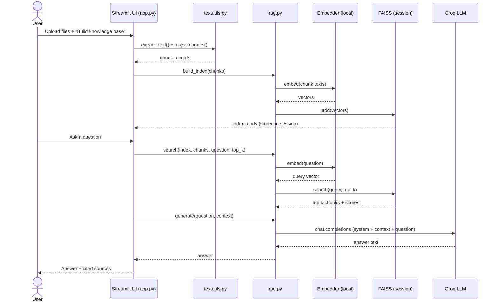

# Product Requirements Document (PRD)

## AskDocs — chat with your documents (a lightweight RAG application)

| | |
|---|---|
| **Author** | Aastha Saini |
| **Status** | Live (MVP) |
| **Last updated** | 2026-07-24 |
| **Repository** | https://github.com/AASTHA381/pom-rag-chatbot |

---

## 1. Overview

**AskDocs** is a Retrieval-Augmented Generation (RAG) web app
that lets anyone upload their own documents (PDF, TXT, Markdown, CSV) and ask
natural-language questions about them. The app retrieves the most relevant
passages from the uploaded content and uses a hosted large language model to
generate concise, grounded answers with cited sources.

It ships with a bundled set of Operations Management study notes as a one-click
sample so first-time visitors can try it instantly without uploading anything.

## 2. Problem statement

People frequently have documents — lecture notes, reports, manuals, research
papers — and want quick answers from them without reading end to end. General
chatbots hallucinate and don't know the contents of private files. Users need a
tool that:

- Answers **only** from their own material (no made-up facts).
- Cites **where** each answer came from.
- Requires **no setup** (no local model, no GPU) and runs on a shared link.
- Keeps uploaded content **private to the session**.

## 3. Goals & non-goals

### Goals
- Let a user build a searchable knowledge base from uploaded files in seconds.
- Return accurate, concise answers grounded in the retrieved context, with sources.
- Run entirely on free/low-cost infrastructure (Streamlit Community Cloud + Groq free tier).
- Be shareable via a single public URL.

### Non-goals (for the MVP)
- Persistent, multi-session document storage or user accounts.
- Multi-user collaboration on the same knowledge base.
- OCR of scanned/image-only PDFs (only embedded text is extracted).
- Fine-tuning or training custom models.

## 4. Target users

- **Students** revising from lecture notes / textbooks.
- **Knowledge workers** querying reports, specs, or manuals.
- **Anyone** who wants a private "ask my PDF" assistant with a shareable link.

## 5. User stories

1. *As a visitor*, I can upload one or more files and click **Build knowledge
   base** so I can ask questions about them.
2. *As a user*, I can type a question and get an answer grounded in my documents,
   with the source passages shown, so I can trust and verify it.
3. *As a first-time visitor*, I can click **Try the sample** to see how it works
   without uploading anything.
4. *As a user*, I can adjust how many passages (top-k) are used per answer.
5. *As a privacy-conscious user*, my uploaded files stay in my own session and
   are not stored on the server after I leave.

## 6. Functional requirements

| # | Requirement |
|---|---|
| FR1 | Accept uploads of `.pdf`, `.txt`, `.md`, `.markdown`, `.csv` (up to 20 files). |
| FR2 | Extract text from PDFs and decode text files to UTF-8. |
| FR3 | Clean and split text into overlapping, paragraph-aware chunks. |
| FR4 | Embed chunks locally and build an in-memory FAISS index per session. |
| FR5 | Retrieve the top-k most similar chunks (cosine similarity) for a question. |
| FR6 | Generate an answer via the Groq LLM using only the retrieved context. |
| FR7 | Display the answer plus an expandable list of cited sources with scores. |
| FR8 | Provide a one-click bundled sample knowledge base. |
| FR9 | Let the user clear the chat and adjust top-k. |

## 7. Non-functional requirements

- **Privacy:** uploaded content lives only in `st.session_state` (per browser session); nothing is written to disk on the server.
- **Cost:** embeddings run locally (free); generation uses Groq's free tier.
- **Performance:** first query loads the embedding model once (cold start); subsequent queries are fast. Indexing is proportional to document size.
- **Portability:** runs on Apple Silicon and Streamlit Community Cloud without a GPU.
- **Security:** the `GROQ_API_KEY` is never committed; it lives in a local `.env` (git-ignored) or Streamlit Secrets.

## 8. System architecture

## 9. Data / processing flow

## 10. Sequence diagram (ask a question)

## 11. Tech stack

| Layer | Choice | Why |
|---|---|---|
| UI | Streamlit | Fast to build, free hosting, chat components |
| Text extraction | pypdf | Simple PDF text extraction |
| Embeddings | sentence-transformers `all-MiniLM-L6-v2` | Small, fast, runs on CPU, free |
| Vector search | FAISS (`IndexFlatIP`) | Exact cosine search, in-memory, no infra |
| Generation | Groq `llama-3.3-70b-versatile` | Very fast inference, generous free tier |
| Config / secrets | python-dotenv + Streamlit Secrets | Keeps API key out of source control |

## 12. Success metrics

- **Answer groundedness:** answers cite retrieved chunks; low hallucination rate.
- **Time to first answer:** < a few seconds after warm start.
- **Activation:** % of visitors who build a knowledge base or try the sample.
- **Reliability:** successful answer rate (no errors) per session.

## 13. Risks & mitigations

| Risk | Mitigation |
|---|---|
| Shared Groq key consumes owner's quota | Monitor usage; add rate limiting / per-user keys later |
| Scanned PDFs have no extractable text | Document limitation; add OCR (e.g. Tesseract) in a future version |
| Large uploads exceed cloud memory | Cap file count (20); chunk sizing; consider on-disk index later |
| Cold start latency (model download) | Cache the embedder with `lru_cache`; small model chosen |

## 14. Future enhancements

- Persistent knowledge bases with lightweight accounts.
- OCR for scanned documents.
- Streaming responses and follow-up (conversational memory).
- Re-ranking retrieved chunks for higher precision.
- Per-user API keys or usage limits.
- Support for `.docx` and web-page URLs.
